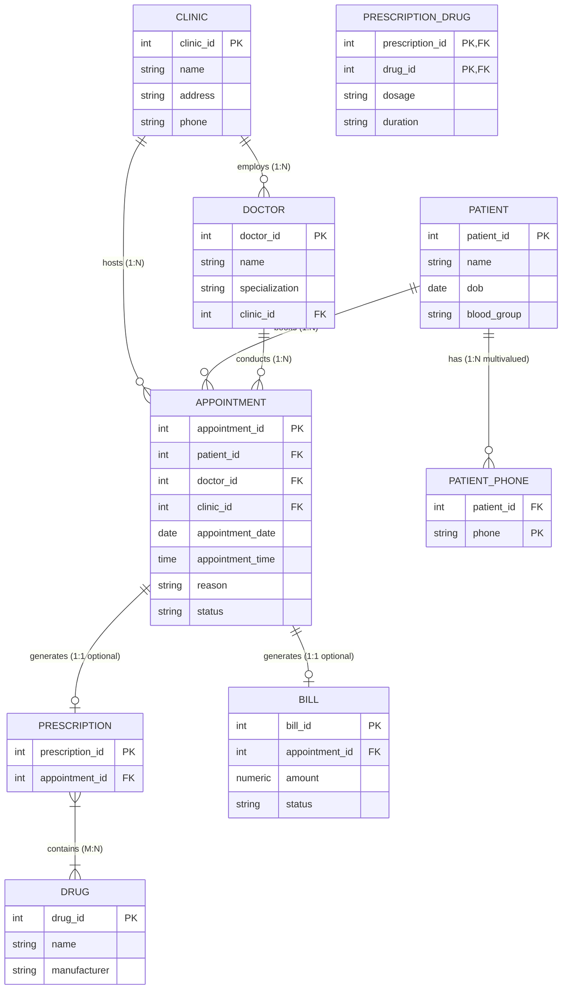

# MediTrack Clinic Database — Design Document (`design.md`)

**Module II · Lab 5: Database Design from Requirements**  
**Author:** Student  
**System:** MediTrack Clinic Network  

---

## Part 1 — Conceptual Design

### 1.1 Entity Sets & Attributes
1. **`clinic`**
   - `clinic_id` (**PK**, Surrogate Integer)
   - `name` (String, Required)
   - `address` (Text, Required)
   - `phone` (String, Required)
2. **`patient`**
   - `patient_id` (**PK**, Surrogate Integer)
   - `name` (String, Required)
   - `dob` (Date, Required)
   - `blood_group` (String, Required)
   - *`phone_numbers`* (**Multivalued Attribute**, extracted to separate relation `patient_phone`)
3. **`doctor`**
   - `doctor_id` (**PK**, Surrogate Integer)
   - `name` (String, Required)
   - `specialization` (String, Required)
4. **`appointment`** (First-class Entity Set)
   - `appointment_id` (**PK**, Surrogate Integer)
   - `appointment_date` (Date, Required)
   - `appointment_time` (Time, Required)
   - `reason` (Text, Required)
   - `status` (String, Enum: `'booked'`, `'completed'`, `'cancelled'`, Default: `'booked'`)
5. **`prescription`**
   - `prescription_id` (**PK**, Surrogate Integer)
6. **`drug`**
   - `drug_id` (**PK**, Surrogate Integer)
   - `name` (String, Required)
   - `manufacturer` (String, Required)
7. **`bill`**
   - `bill_id` (**PK**, Surrogate Integer)
   - `amount` (Decimal/Numeric, Required, `CHECK (amount >= 0)`)
   - `status` (String, Enum: `'paid'`, `'unpaid'`, Default: `'unpaid'`)

**Multivalued attribute:** `Patient.phone_numbers`

**Derived attributes:** None specified in the requirements.

---

### 1.2 Relationships, Cardinalities & Participation
- **`doctor works_at clinic`**: `1:N` cardinality (Doctor side is N, Clinic side is 1). Doctor participation is **total** (every doctor works at exactly one clinic), Clinic participation is **partial** (a new clinic might temporarily have 0 doctors).
- **`patient books appointment`**: `1:N` cardinality (Patient side is 1, Appointment side is N). Patient participation is **partial** (a patient can register without booking immediately), Appointment participation is **total** (every appointment must belong to a patient).
- **`doctor conducts appointment`**: `1:N` cardinality (Doctor side is 1, Appointment side is N). Doctor participation is **partial**, Appointment participation is **total**.
- **`clinic hosts appointment`**: `1:N` cardinality (Clinic side is 1, Appointment side is N). Clinic participation is **partial**, Appointment participation is **total**.
- **`completed_appointment generates prescription`**: `1:1` cardinality. Appointment participation is **partial** (only completed appointments can have prescriptions), Prescription participation is **total** (a prescription must originate from an appointment).
- **`prescription contains drug`**: `M:N` cardinality. Prescription participation is **total** (contains $\ge 1$ drugs), Drug participation is **partial** (a drug might exist in inventory without being prescribed yet).
  - *Relationship Attributes:* `dosage` (String), `duration` (String).
- **`completed_appointment generates bill`**: `1:1` cardinality. Appointment participation is **partial** (only completed appointments generate a bill), Bill participation is **total** (a bill must belong to an appointment).

---

## Part 2 — ER Diagram (Mermaid)

---

## Part 3 — Logical Design / 7-Step Mapping

1. **Strong Entity Sets:**
   - `clinic(clinic_id PK, name, address, phone)`
   - `patient(patient_id PK, name, dob, blood_group)`
   - `doctor(doctor_id PK, name, specialization, clinic_id FK)`
   - `drug(drug_id PK, name, manufacturer)`
   - `appointment(appointment_id PK, patient_id FK, doctor_id FK, clinic_id FK, appointment_date, appointment_time, reason, status)`
2. **Multivalued Attributes:**
   - `patient_phone(patient_id FK, phone, PK(patient_id, phone))`
3. **1:1 Relationships (Prescription & Bill):**
   - `prescription(prescription_id PK, appointment_id FK UNIQUE)`
   - `bill(bill_id PK, appointment_id FK UNIQUE, amount, status)`
4. **M:N Relationships (Prescription-Drug):**
   - `prescription_drug(prescription_id FK, drug_id FK, dosage, duration, PK(prescription_id, drug_id))`

---

## Part 4 — Connection Traps Analysis

- **Avoided Fan Trap:** If `patient` were connected directly to `prescription` and `doctor` directly to `prescription`, there would be a fan trap regarding *which specific clinic visit* resulted in a prescription. By modeling `appointment` as a central entity set linking `patient`, `doctor`, and `clinic`, every prescription and bill traces back to an exact, unambiguous event.
- **Avoided Chasm Trap:** If we tried to link `patient` directly to `drug` without storing appointments, we could not determine which doctor prescribed a drug or at which clinic the drug was administered. The explicit `appointment` entity bridges all optional pathways.

---

## Part 5 — Design Review & Trade-offs

1. **Spec Ambiguities & Choices:**
   - *Ambiguity 1:* Can a doctor conduct an appointment at a clinic other than their primary employed clinic?
     - *Decision:* We enforced `clinic_id` on doctor and mandatory matching on appointment, but retained `clinic_id` in `appointment` to allow portable audit tracking.
   - *Ambiguity 2:* Can an unpaid bill exist for cancelled appointments?
     - *Decision:* Only `completed` appointments generate bills (enforced via application/business rule or database queries).
2. **Rejected Alternative Design:**
   - *Rejected Idea:* Storing prescribed drugs as a comma-separated text string inside `prescription` (e.g. `"Amoxicillin 500mg, Paracetamol"`).
   - *Why Rejected:* Violates **1NF** (non-atomic values). Causes insertion/update anomalies and prevents SQL aggregation for query Q3 (*"top 3 prescribed drugs"*).
3. **3NF Justification:**
   - All non-key attributes are fully functionally dependent on their candidate primary keys (no partial dependencies $\implies$ **2NF**). No non-key attribute determines another non-key attribute (no transitive dependencies $\implies$ **3NF**).
